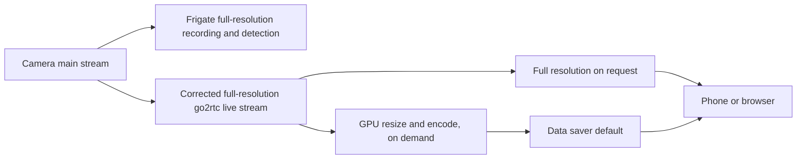

# Setup critique and data-saver live viewing — 2026-09-12

## Assessment

The system now has a workable recording pipeline and corrected live timestamps,
but reliability is its biggest weakness. Camera firmware failures, the Windows
and WSL lifecycle, and insufficient independent monitoring matter more than
additional compute. Keep the working recording path stable while improving
live delivery and observability in separate, measurable changes.

This review used the running Frigate 0.17.2/go2rtc 1.9.10 deployment, current
configuration and scripts, actual GPU/storage/power settings, and short live
tests. It is not a long-duration availability or security audit. Historical
claims in older documents are not automatically current facts.

## Implemented: lower bandwidth by default, full resolution on request

Every camera now has two configured live-view choices, in this order:

| Choice | Video | Audio | Use |
|---|---|---|---|
| Data saver | 960x540 Allwinner / 960x544 MStar; 10 fps target | AAC and Opus | Default overview and phone viewing |
| Full resolution | Original 1920x1080 / 1920x1088 and source frame rate | AAC and Opus | Inspect detail when needed |

The first option is the configured default, including Frigate's All Cameras
dashboard. A browser can remember a prior manual selection; choose Data saver
once if that device still opens Full resolution. This is a default plus manual
selection, not automatic bandwidth adaptation or a voice command interface.

Recordings and detection retain their original camera inputs and dimensions.
Lower live resolution does **not** reduce recording quality, camera-to-NVR Wi-Fi
traffic, recording storage, or the decode cost of the direct recording input.



Data saver consumes the existing local full-resolution restream, so it does
not add a third upstream camera connection. Full and data-saver viewers share
that parent stream. NVIDIA hardware decodes, scales and encodes the reduced
video; AAC is copied and Opus is supplied for compatible clients. The encoder
targets 400 kbps video with 600 kbps maximum-rate/VBV settings, a one-second
GOP at the requested 10 fps, and no B-frames. Bitrate includes overhead/audio
and can fluctuate; the maximum-rate setting is not a network traffic shaper.

The pipeline retains the corrected parent timestamp behavior. No camera codec,
daemon, stream-selection setting, firmware, model, retention policy or recording
argument was changed for this work.

## Measurements

In a sequential cam3 comparison, total fragmented-MP4 bitrate measured 0.840
Mbps for full resolution and 0.474 Mbps for Data saver: about **44% lower**.
This was a short sample, not a guarantee for all scenes or motion levels.

All six data-saver streams also ran concurrently and fully decoded:

| Camera | Dimensions | Total sampled bitrate |
|---|---|---:|
| cam1 | 960x544 | 0.465 Mbps |
| cam2 | 960x544 | 0.471 Mbps |
| cam3 | 960x540 | 0.466 Mbps |
| cam4 | 960x544 | 0.462 Mbps |
| cam5 | 960x544 | 0.457 Mbps |
| cam6 | 960x540 | 0.467 Mbps |

That is approximately 2.8 Mbps combined payload for six live views in the
sample, before transport overhead. All six maintained 5.0–5.1 detection FPS.
GPU encoder utilization sampled at 1%, decoder utilization 34%, and GPU memory
6.7 GiB. Before testing, encoder utilization was 0%, decoder 21%, and GPU
memory 4.4 GiB. Other workload and sampling differences prevent attributing
every GPU utilization change to this feature.

Matching identical copied AAC audio frames between full and data-saver streams
on cam3 measured 0.329 s median additional arrival delay, 0.469 s P95 and
0.547 s maximum. This checks added audio delivery delay, **not** physical
video/audio synchronization or glass-to-glass phone latency. Video is re-encoded,
so the exact-pixel hash latency checker for original live streams cannot be
used to certify the reduced-video path. Lower bandwidth is not a promise of
lower end-to-end latency; startup adds another on-demand encoder stage.

Concurrent eight-second Opus checks passed on five cameras. Cam5 timed out
after decoding 2.42 seconds; the go2rtc log recorded EOF on its full-resolution
camera producer. An isolated repeat then passed MP4 video/AAC, 20 seconds of
AAC and 20 seconds of Opus. The passing repeat does not erase the dropout or
establish its cause. The reduced stream inherits parent-stream interruptions.

Frigate was reloaded to activate the choices, then the shared-network Tailscale
sidecar was restarted. The running API confirms both ordered choices on every
camera and the `home-nvr:5000` route responds. Phone quality/selector acceptance
is pending; backend decoding alone does not establish the viewing experience.

The post-reload concurrent MP4 check passed again on all six cameras
(0.458–0.470 Mbps; capture FPS 5.0–5.2). The first recording check found a
damaged cam4 segment: 69 decoded video frames and an H.264 macroblock error.
At 16:49:21–16:49:33 in container log time, Frigate lost cam4's input, restarted
FFmpeg and encountered RTSP connection refusals. The fault recovered without
a camera configuration change. A later sweep decoded fresh full-resolution
video and AAC on all six, including cam4; sampled recording ages were 22–31 s.
This establishes recovery, not uninterrupted recordings or a proven cause.
Retain the failure when assessing fleet/default-view reliability.

## Priorities for further optimization

| Priority | Finding | Recommended action and reason |
|---|---|---|
| 1 | No independent end-to-end availability monitor | Check from outside WSL: tailnet reachability, fresh recording per expected camera, missing frames and disk free space. Alert on state changes. A WSL-based probe can start the failed VM and hide the outage. Choose alert destination before scheduling. |
| 1 | Camera resets and RTSP refusals remain unresolved | Capture camera uptime, exact connection errors and active upstream connection counts when faults occur. Do not classify all failures as contention. Change cam6's `both` setting only as its own controlled trial, since it differs from the five `high` cameras. |
| 2 | Hosting depends on Windows + WSL + Docker + shared-network Tailscale | The keepalive task currently runs and AC sleep is disabled, but these are mitigations. For stronger unattended reliability, evaluate a dedicated always-on Linux host; do not migrate the working service without an acceptance/rollback plan. |
| 2 | Recording storage is on a Windows drive through WSL's 9p mount | Measure storage latency and recording gaps under load. Evaluate Linux-native storage for application/database state and recording I/O if measurements justify migration; avoid assuming a filesystem move is an instant fix. |
| 2 | Live phone transport and buffer are not yet characterized | Capture an active phone session's MSE/WebRTC type, buffer and Tailscale direct/relay path. Keep the direct `http://home-nvr:5000` route while testing; do not assume WebRTC works merely because port 8555 is published. |
| 2 | Mutable container image tags | Pin tested Frigate/Tailscale digests for reproducible rollback, then upgrade deliberately. Do not pull `stable` blindly during unrelated configuration work. |
| 2 | Full-resolution decode for a 320x320 detector | There may be savings from resizing or a reliable lower-resolution detection input, but validate person detection and recording independence first. Merely changing detect dimensions does not remove all upstream decode cost. |
| 3 | Documentation and helpers accumulated assumptions | Keep history in dated findings, current behavior in concise config/docs, and tests that fail on missing streams. The live verifier now resolves full and reduced stream dimensions instead of treating aliases as cameras. |

The GPU is already capable of the new work; replacing it or buying more compute
is not supported by these measurements. Likewise, enabling both camera streams
across the fleet would increase load on the least reliable part of the setup.

The existing `scripts/nvr-status.sh` is only an interactive summary: an empty
camera map can print `ALL OK`, and failed-camera output does not reliably yield
a failing process status. Do not wire it directly into alerts. Its replacement
should require the expected six cameras, fail closed, and run from a vantage
point that cannot start WSL while measuring availability. The Tailscale Docker
healthcheck exposes one failure state but does not itself restart an unhealthy
container or check camera recordings.

## Capacity and operating observations

- RTX 4080 SUPER, 16 GiB GPU memory; one initial Frigate snapshot used about
  1.15 CPU cores and 4.34 GiB guest memory. Encoder and decoder capacity are
  separate from CUDA inference utilization.
- Recording drive had about 433 GB free (Windows decimal units); Frigate
  reported about 412,473 MiB free. This is drive-wide free space, not a dedicated
  NVR quota. Keep retention/free-space alerts; the new live profile does not
  reduce recording storage.
- `/dev/shm` sampled at 773 MiB used of 1 GiB. It is not exhausted, but needs
  observation under peak load. Cache tmpfs sampled around 48 MiB of 954 MiB.
- Windows AC sleep timeout is zero (never); DC timeout is 600 seconds.
  `HomeNVR-WSL-Keepalive` was Running. These reads do not prove unattended
  recovery from a Windows restart or a camera/power failure.
- Port 5000 is the unauthenticated Frigate endpoint configured for this trusted
  LAN/tailnet deployment. Review actual tailnet grants and LAN exposure before
  adding other users. No public forwarding or permissions were changed here.

## Verification and rollback

Frigate's installed schema accepted the configuration. A semantic comparison
confirmed no changes outside `go2rtc` and the cameras' `live` settings. Unit
tests cover both reduced geometries, original geometry, unknown aliases and
unsupported transforms, alongside the audio-probe regression tests.
All 11 unit tests passed; both modified shell wrappers passed Bash syntax
checks, and the dimension helper returned 960x540 inside the running container.

For a targeted check, use the expected dimensions for that profile:

```sh
docker exec -i frigate python3 - cam3_kitchen_mobile 960 540 < scripts/verify-live-audio-any.py
docker exec -i frigate python3 - cam5_laundry_mobile 960 544 < scripts/verify-live-audio-any.py
# The complete sweep now expects 12 streams: six full + six data saver.
bash scripts/verify-all-live-audio.sh 12
```

The original matching-frame `verify-live-latency.py CAMERA` still checks the
original full-resolution stream, not the re-encoded Data saver profile.

Rollback: remove the six `_mobile` sources, their GPU presets, and the two-choice
`live.streams` blocks. Preserve the original full-resolution stream definitions
and their timestamp fix. Reload Frigate so the UI sees the change; verify the
shared-namespace Tailscale sidecar afterward. Do not revert later unrelated edits
by replacing the entire configuration with an old backup.

## References

- [Frigate live-stream choices and transport requirements](https://docs.frigate.video/configuration/live/)
- [Installed-version live schema](https://github.com/blakeblackshear/frigate/blob/v0.17.2/frigate/config/camera/live.py)
- [go2rtc 1.9.10 FFmpeg argument construction](https://github.com/AlexxIT/go2rtc/blob/v1.9.10/pkg/ffmpeg/ffmpeg.go)
- [go2rtc 1.9.10 hardware encoding](https://github.com/AlexxIT/go2rtc/blob/v1.9.10/internal/ffmpeg/hardware/hardware.go)
- [Preceding latency correction](live-latency-fix.md)
