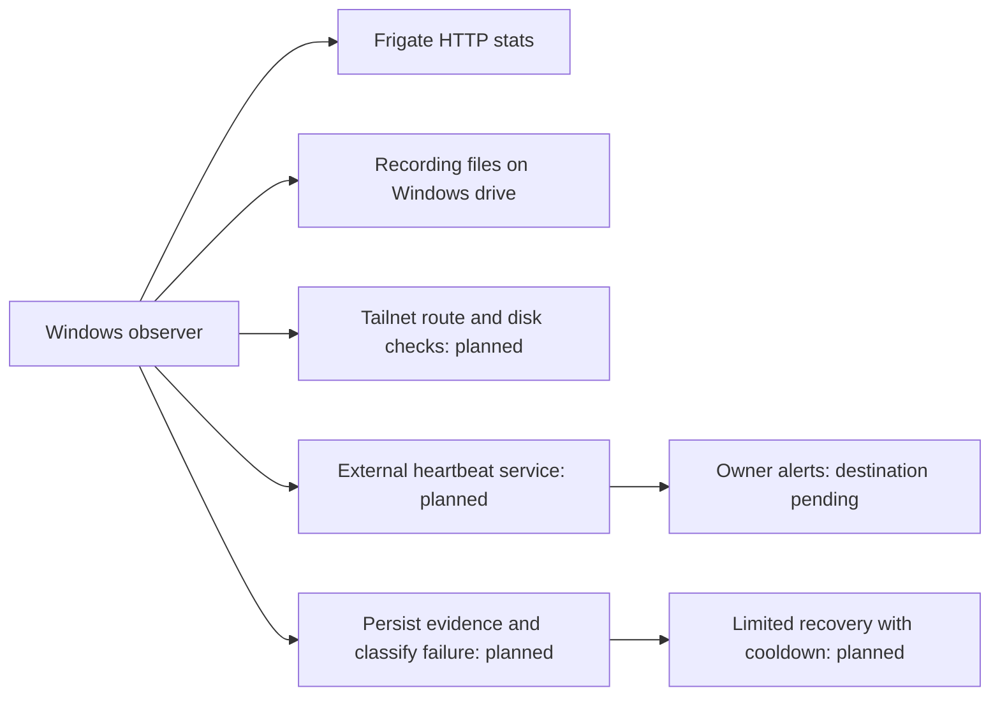

# Unattended recovery and independent alerts — design review, 2026-09-12

## Recommendation and current status

Use a Windows watchdog for observation and limited recovery, plus an external
missed-heartbeat service for alerts when the whole PC or home connection fails.
No AI session is needed to run this. A monitor inside the same WSL/Docker stack
cannot reliably report that stack's disappearance.

This review implemented and tested the read-only Windows observation component,
`scripts/probe-nvr-windows.ps1`. It does not call WSL, Docker or camera APIs,
restart services, install scheduled tasks, or send notifications. The unattended
controller and external alert account/integration are **not enabled**.



The Windows Tailscale service is Running. The existing WSL keepalive already
has startup and five-minute triggers and was Running. Those settings do not
need another duplicate keepalive task.

## What was verified

- Direct Windows HTTP reads and recording-file inspection work without running
  a WSL command. All six cameras had about 5 FPS and fresh nonempty recordings.
- The reusable probe checks a fixed expected camera list, rather than deriving
  it from whichever cameras happen to appear in a response.
- It fails on missing/invalid/zero frame rates, missing/empty/stale recording
  files, implausibly future file times, HTTP errors, and an empty expected list.
- It searches the current and previous UTC recording hour, including midnight.
  Five fixture tests passed under Windows PowerShell 5.1, including missing
  cameras, zero FPS, stale media, empty expectations and a date boundary.
- The live reusable probe passed for all six; latest file ages were about
  0.4–5.4 seconds in that sample. This tests freshness and frame capture, not
  media decodability. Keep separate periodic decode checks for corruption.

Read-only use from the deployment checkout:

```powershell
powershell.exe -NoProfile -ExecutionPolicy Bypass -File scripts\probe-nvr-windows.ps1
```

The execution-policy flag applies to that process, not a machine-wide setting.
The default expected list is this installation's six cameras. Intentional
camera disablement should be explicit maintenance state in the future controller,
not silently inferred from missing data.

## Proposed unattended recovery policy

Start with a 60-second observation interval and three consecutive failures.
Save each pre-recovery snapshot on the Windows drive **before** invoking WSL.
Use atomic persistent state, a process deadline, a single-instance lock, bounded
logs, and a maintenance switch with an expiry time. Re-read the fault before
acting; do not execute a stale recovery decision after a manual repair.

| Confirmed condition | Recovery action | What must remain untouched |
|---|---|---|
| Local Frigate and recordings healthy, tailnet route repeatedly fails | Inspect Windows Tailscale service and, only if that client is healthy and evidence points to the NVR sidecar, restart/recreate that sidecar once against the current Frigate namespace | Frigate and recordings |
| Local API unavailable and recordings stopped advancing | After saving Windows evidence, diagnose WSL/Docker; start Docker if stopped, then use the pinned coordinated recovery helper when needed | Camera settings and media |
| API unavailable but recordings still advance | Alert and collect diagnostics first; do not immediately sacrifice recordings for a UI failure | Recording pipeline |
| One camera has no frames/stale recordings while other cameras work | Alert with camera identifier; let Frigate's existing FFmpeg watchdog retry | Whole NVR, other cameras, camera power/settings |
| All cameras fail but Frigate API is healthy | Investigate common LAN/AP/power/storage failure first; only recover NVR after evidence identifies an NVR fault | Avoid a blind reboot loop |
| Low disk space | Alert; retain configured retention behavior | Never delete arbitrary files or shorten retention automatically |
| GPU driver/prestart failure survives one recovery attempt | Alert and stop automatic escalation | Windows and WSL are not automatically rebooted |

Suggested starting limits: a 15-minute cooldown after an attempted recovery,
at most two recovery attempts per hour, and escalation to the owner afterward.
Persist these limits across process restarts and reboots. A Windows/WSL restart
must not reset the attempt budget. Do not claim recovery merely because a
command exited successfully: require several healthy observations, advancing
recordings and a working tailnet route.

The current `restart-nvr.sh --apply` was tested, but recreates both containers
and caused 43–52 seconds of recording gaps. It must **not** become the action
for every alarm. The narrower sidecar-only action needs its own implementation,
shared lock and verification before unattended mode.

A single native Windows task can own the controller loop under the account
that owns the WSL distro. Verify its actual noninteractive HTTP access and WSL
permissions before deployment; do not assume an interactive shell test proves
the scheduled-task principal works. Keep recovery state outside containers.

## Independent alerts

Recommended first provider: hosted Healthchecks.io. It raises alerts when
expected pings stop arriving, so it can notify even when the home PC cannot
send a failure message. Its current free plan supports 20 checks, more than
needed for an initial aggregate NVR-health check. Recheck pricing when enrolling.

The observer should send a success heartbeat only after the whole required
assessment completes successfully: local API, all expected recording streams,
disk threshold, and the tailnet route. A completed but failed assessment can
send `/fail` once the failure debounce has elapsed. A crashed/stalled watchdog
or power/internet outage produces no heartbeat and is detected externally.
Keep failure and recovery notifications on state transitions rather than every
minute. Do not enable emergency/repeating phone notifications by default.

Suggested starting settings: one-minute period, four-minute grace, so a stopped
sender alerts approximately five minutes after its last successful heartbeat.
If using explicit failure signals, apply the local three-failure debounce first;
`/fail` bypasses waiting for a missing-heartbeat grace window. Maintenance must
pause the external check too, with a reminder/expiry process, so planned work is
not misreported as healthy.

Important distinction: this external service watches heartbeat arrival. It does
not itself join Tailscale or prove a remote phone can play video. A stronger
functional check requires another always-on device or remote host on the
tailnet to probe the NVR independently. Hosting Uptime Kuma on this same NVR
would still leave whole-host outage detection dependent on the failed host.

Email is supported; phone push can use a supported integration such as Pushover.
The owner has been asked for the preferred destination. Account/integration
setup and recipient confirmation are required before sending a real test.
No external account, paid plan, check or notification was created during review.

Keep heartbeat URLs and integration tokens in ignored `secrets/` files, outside
the public repository and logs. Send generic operational status, not camera
footage, audio, LAN details or full configuration. Validate that a check exists
and receives pings in the provider dashboard: an HTTP status alone is not proof
of correct enrollment. Prime the check and deliberately test a missed heartbeat
and a recovery notification before relying on it.

## Developer acceptance sequence

1. Implement the controller with a dry-run mode and the policy above. Unit-test
   debounce, cooldown persistence, duplicate runs, maintenance expiry, stale
   decisions and partial probe failure. Keep the observation phase WSL-free.
2. Run in observation-only mode long enough to catch normal reconnects and
   planned camera unplugging. Confirm it does not open extra camera RTSP sessions.
3. Configure the chosen external alert integration and deliver an owner-confirmed
   test. Stop only the sender to verify independent missed-heartbeat delivery.
4. Pilot a sidecar-only fault/recovery and confirm recordings remain continuous.
   Then test a controlled NVR recovery with the expected maintenance gap.
5. Validate under the actual scheduled-task principal and after a planned host
   reboot. Enable limited automatic recovery only after those gates pass.

This is the remaining implementation plan, not a claim that unattended recovery
or alerts are already running. The read-only probe is available now.

## Sources

- [Healthchecks.io heartbeat and state model](https://healthchecks.io/docs/)
- [Healthchecks.io current plans](https://healthchecks.io/pricing/)
- [Healthchecks.io notification integrations](https://healthchecks.io/docs/configuring_notifications/)
- [Healthchecks.io ping API, including failure signals](https://healthchecks.io/docs/http_api/)
- [Docker automatic restart policies](https://docs.docker.com/engine/containers/start-containers-automatically/)
- [Compose dependency restart behavior](https://docs.docker.com/compose/how-tos/startup-order/)
